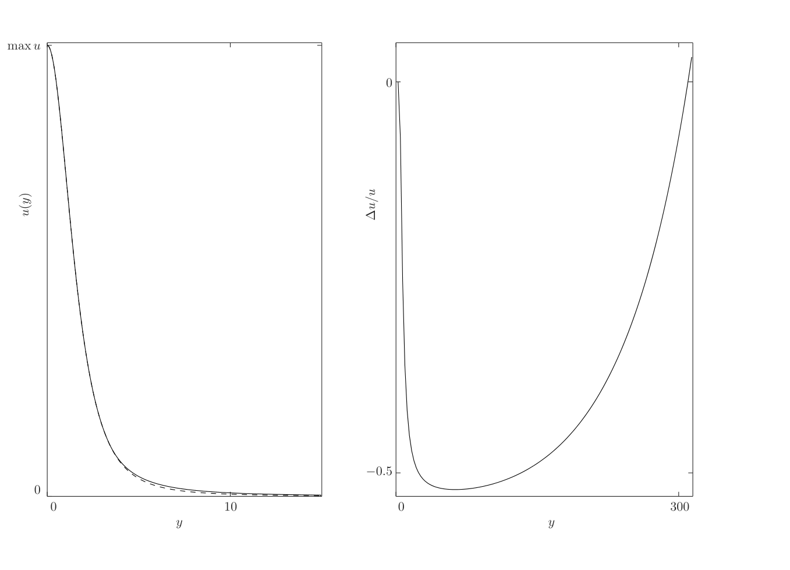
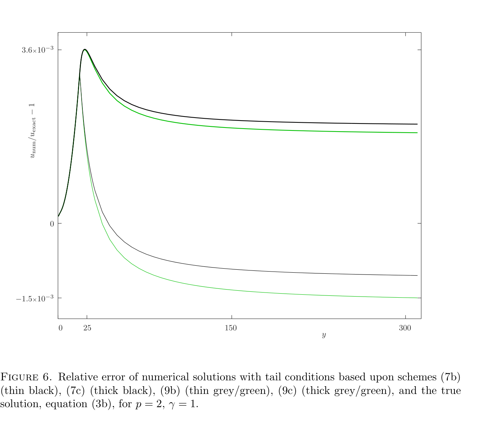
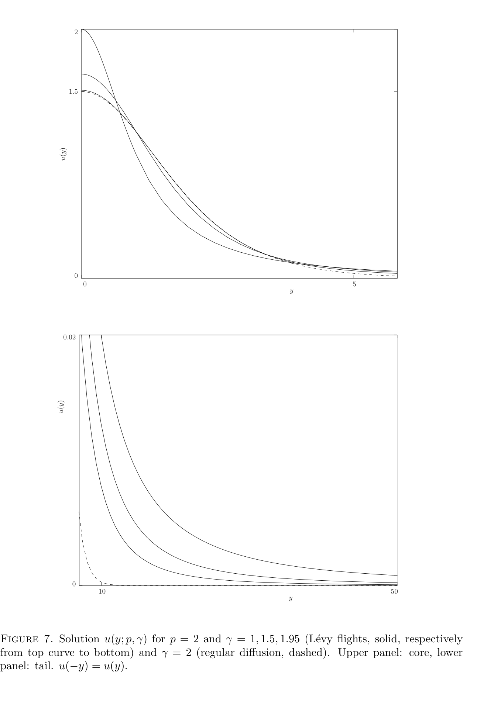
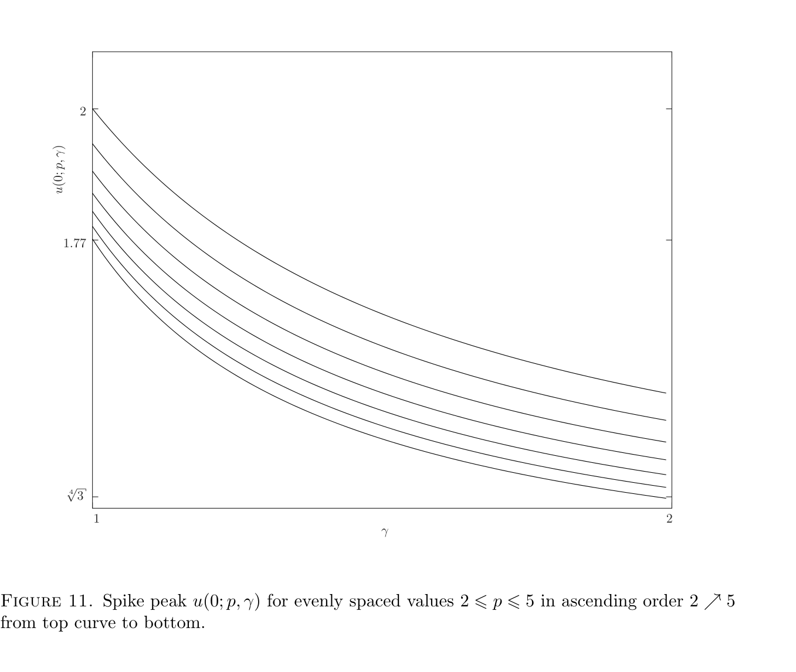

# fractional-bvp-tail-correction

Numerical solver and tail-correction method for boundary value problems on infinite domains whose solutions have **slowly decaying tails** — the kind of tail that makes a Dirichlet/Neumann cut-off at "large y" go badly wrong.

Companion code to:

> K. Booker and Y. Nec, *On Accuracy of Numerical Solution to Boundary Value Problems on Infinite Domains with Slow Decay*, **Mathematical Modelling of Natural Phenomena** (2019). DOI [10.1051/mmnp/2019057](https://doi.org/10.1051/mmnp/2019057).

## What this solves

The example problem in the paper is the fractional ground state equation

> &nbsp;&nbsp;&nbsp;&nbsp;𝔇<sup>γ</sup><sub>|y|</sub> u − u + u<sup>p</sup> = 0,&nbsp;&nbsp;&nbsp; 1 ≤ γ ≤ 2,&nbsp;&nbsp; p > 1,

with u(±∞) = 0, u > 0, u(−y) = u(y). The operator 𝔇<sup>γ</sup><sub>|y|</sub> is the one-dimensional fractional Laplacian −(−Δ)<sup>γ/2</sup>. At γ = 2 the solution is the classical sech<sup>2</sup> homoclinic; for 1 ≤ γ < 2 it is a ground state whose tail decays only algebraically as y<sup>−(γ+1)</sup>.

Algebraic tails do **not** approach machine zero on any practical truncated interval. Imposing u = 0 at the boundary therefore distorts the entire solution — not just the tail. The contribution of this work is a generic **tail condition** built from the asymptotic decay law, applied over a surprisingly large fraction of the domain, that drives the relative error down by ~3 orders of magnitude.

## The problem (and why this matters)

Without the tail correction, naïvely setting u = 0 at the boundary of a truncated domain gives a solution with up to **order-unity relative error** — and the error diffuses inward, polluting the spike core, not just the tail:



*Spike solution with (solid) and without (dashed) tail error control for p = 2, γ = 1.5. Right panel shows the relative error of the two; the naïve solution is off by ~50%.*

With the tail condition the relative error against the known exact solution (γ = 1, p = 2) drops to ~10<sup>−3</sup> uniformly across the domain, regardless of which of the four tail schemes is used:



*Relative error of u<sub>num</sub>/u<sub>exact</sub> − 1 for the four tail-condition discretisations (eqs. 7b, 7c, 9b, 9c). The discretisation order matters less than where the tail condition is applied — the fractional Laplacian is the dominant error source.*

## What the solver computes

For p = 2 and several values of γ, the upper panel shows the solution core; the lower panel zooms into the tail and makes the slow algebraic decay visible against the exponential (dashed) reference:



*u(y; 2, γ) for γ ∈ {1, 1.5, 1.95} (solid, slowest to fastest decay) and γ = 2 (dashed, exponential). Note the tail panel: even at γ = 1.95 the algebraic decay is several orders of magnitude slower than the exponential.*

## Repository layout

| File                                  | Purpose                                                                             |
| ------------------------------------- | ----------------------------------------------------------------------------------- |
| `homoclinic.c`                        | Main solver. Inlines tail scheme (9c), the variant settled on in the experiments.   |
| `first_order_first_derivative.c`      | Variant solver using tail scheme (7b).                                              |
| `first_order_second_derivative.c`     | Variant solver using a backward-difference second-derivative tail relation.         |
| `second_order_first_derivative.c`     | Variant solver using tail scheme (7c).                                              |
| `second_order_second_derivative.c`    | Variant solver using tail scheme (9c) in standalone form.                           |
| `homoclinic.in`                       | 12 whitespace-delimited run parameters read by every solver.                        |
| `homoclinic.in.annotated`             | Same values with inline `#` comments — reference only, not loadable as-is.          |
| `hclin.m`                             | MATLAB post-processing: overlays analytic references and fits the tail decay rate.  |
| `Makefile`                            | Builds the main solver and all four variants.                                       |
| `docs/figures/`                       | PNGs of selected paper figures used in this README.                                 |

## Build & run

Requires a C compiler and `make`. Tested with `gcc` on Linux/macOS and MinGW on Windows.

```sh
make                         # builds homoclinic + all four scheme variants
./homoclinic                 # reads homoclinic.in, writes homoclinic.out + ic.in
```

To run a variant scheme instead:

```sh
./first_order_first_derivative      # eq. (7b)
./second_order_second_derivative    # eq. (9c)
```

Then post-process in MATLAB:

```matlab
hclin
```

All solvers read `homoclinic.in` and write `homoclinic.out` (the normalised solution u on the FFT mesh) and `ic.in` (final u, v state for warm restarts via the `init = 1` flag).

## Parameter file

`homoclinic.in` contains 12 whitespace-delimited values, in order:

| #  | Name   | Type   | Meaning                                                                       |
| -- | ------ | ------ | ----------------------------------------------------------------------------- |
| 1  | `mt`   | int    | Max time-stepping iterations.                                                 |
| 2  | `init` | int    | `0` = initial condition from interp of (3a)/(3b); `1` = read from `ic.in`.    |
| 3  | `g`    | double | Anomaly index γ ∈ [1, 2]. γ = 2 recovers the regular Laplacian.               |
| 4  | `p`    | double | Non-linearity exponent (> 1).                                                 |
| 5  | `n`    | int    | Domain scaling factor; effective domain is (−2πn/ε, 2πn/ε).                   |
| 6  | `dt`   | double | Euler time step.                                                              |
| 7  | `ndts` | int    | Print progress every `ndts` steps (when `ir = 1`).                            |
| 8  | `ir`   | int    | Verbose flag: `1` = print progress, `0` = silent.                             |
| 9  | `N`    | int    | Number of mesh points; **must be a power of 2** for the FFT.                  |
| 10 | `D`    | double | Inhibitor diffusion coefficient.                                              |
| 11 | `eps`  | double | Activator diffusion coefficient; together with `n` sets the truncated domain. |
| 12 | `tau`  | double | Reaction time constant (τ<sub>o</sub> in the paper).                          |

See `homoclinic.in.annotated` for the same information beside the live values. The default `homoclinic.in` corresponds to the (p, γ) = (2, 1) ground state case where an exact reference solution (3b) is available.

## Tail decay constant

The motivating quantity in the paper is the tail constant a(p, γ) defined by u(y) ∼ a(p, γ) y<sup>−(γ+1)</sup>. The solver produces a smooth, monotone dependence of the spike peak u(0; p, γ) on both arguments, a non-trivial finding that supports the physicality of the Lévy-flight diffusion model:



*u(0; p, γ) for evenly spaced p ∈ [2, 5], top curve to bottom. The improper limit γ → 2<sup>−</sup> is visible at the right edge — the algebraic tail never converges to the exponential one, but the peak does approach the classical value 2.*

## Citation

If this code is useful in your research please cite the paper:

```bibtex
@article{BookerNec2019,
  author  = {Booker, Kyle and Nec, Yana},
  title   = {On Accuracy of Numerical Solution to Boundary Value Problems on Infinite Domains with Slow Decay},
  journal = {Mathematical Modelling of Natural Phenomena},
  year    = {2019},
  doi     = {10.1051/mmnp/2019057}
}
```

## Authors

- **Kyle Booker** — Department of Mathematics and Statistics, Thompson Rivers University
- **Yana Nec** — Department of Mathematics and Statistics, Thompson Rivers University

## Acknowledgements

This work was supported in part by Canada Foundation for Innovation grant #35174 (computational cluster, YN) and NSERC Undergraduate Student Research Award 521927–2018 (KB).

## License

[MIT](LICENSE).
